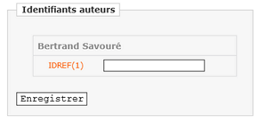
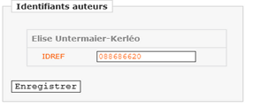
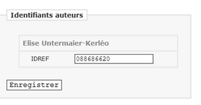
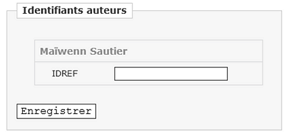

# Plugin Idplus pour Lodel

Ce plugin permet, en interrogeant la base IDREF, de renseigner les identifiants IDREF des auteurs d'un article à partir de son formulaire d'édition.
Lorsque d'autres identifiants existent pour un auteur (HAL, ORCID, ISNI ou ARK) ils sont également récupérés.
Une icône-lien apparait alors en fin d'article dans la section *Auteurs - Autres ressources du même auteur.*

> Afin de stocker les identifiants en base de données, de nouveaux champs sont nécessaires.
> Cela implique un écart par rapport au modèle éditorial actuel d'Open Edition.
> En cas de migration vers OE, ces informations ne seraient donc plus disponibles.

## Prérequis
- Lodel 1.0

## Installation
Dans le répertoire *share/plugins/custom/* de votre installation, dézippez l'archive du plugin ou clonez le dépôt :
```
git clone https://github.com/oliviercrouzet/idplus/.git
```

## Ajout de nouveaux champs dans la base mysql

C'est possible de le faire par l'interface d'administration ou bien à partir d'un script.

### Via l'interface Web :
```
Administration, section Modèle éditorial / Classes d'index de personnes / Champs
Tableau *Définition des relations entre entités et personnes* : Ajouter un champ.
```
Renseigner les zones pour chaque identifiant sur le modèle suivant (ici idref) :
```
Identifiant unique : idref
Nom utilisé dans l'interface : IDREF
Proposé à partir du niveau... : simple
Type de champ : Texte court
XPath OTX : //tei:idno\[@type='IDREF']
Condition : Aucune condition
Type d'affichage dans l'interface : Utiliser un champ de formulaire
poids pour le moteur de recherche : non indexé
```

### Via un script php

A la racine de votre installation Lodel, lancer le script [*nova\_me\_add\_ids.php*](https://github.com/oliviercrouzet/idplus/blob/master/tools/nova_me_add_ids.php) :
`php nova_me_add_ids.php site1 site2`

## Activation
Accédez à l'administration des plugins dans l'administration générale (Administrer/Plugins).
> url =>  `https://votreinstallation/lodeladmin/index.php?do=list&lo=mainplugins`

  * Si on clique sur *Installer sur tous les sites*, le plugin est non seulement copié mais aussi directement activé au niveau de chaque site, ce qui n'est pas forçément souhaitable.
  * Si, on clique sur *Activer*, le plugin est installé mais pas activé... Sur chaque site, on retrouve le plugin dans le tableau des plugins (Administration/Plugins) et on peut choisir à ce niveau de l'activer ou non.

## Usage

En mode édition d'article, une section "Identifiants auteurs" apparait au dessous de l'encadré des fichiers annexes.  
Si les identifiants pour un auteur ne sont pas encore disponibles dans la base, une requête est effectuée automatiquement sur ses nom et prénom dans la base idref.  
Lorsqu'un idref est trouvé puis enregistré, une deuxième requête est lancée pour récupérer les autres identifiants fournis en plus de l’idref.  
Les identifiants sont alors ajoutés à tous les articles du même auteur pour lesquels ils n'auraient pas encore été renseignés.

### 4 cas de figure possibles :

1. Un lien *IDREF* orange apparait suivi d'un nombre d’occurrence entre parenthèse.  
     
   => Un clic sur la mention IDREF ouvre dans votre navigateur autant d’onglets que d’occurrences trouvées (limitées à 10).  
   Après vérification sur la base IDREF, on renseigne le bon identifiant et on enregistre.

2. La mention IDREF et le numero idref apparaissent en orange.  
     
   => Les identifiants sont déja disponibles dans la base pour d'autres articles du même auteur mais pas encore enregistrés pour cet article.  
   Il vous reste dont à cliquer sur *Enregistrer* et ce sera fait.

3. La mention IDREF et le numero idref apparaissent en gris.  
     
   => L'idref est déja renseigné pour cet auteur et cet article.

4. La mention IDREF apparait en gris et aucun numéro idref n'apparait.  
     
   => L’idref pour cet auteur n’a pas été trouvé.


## Désinstallation

La désinstallation complète d'un plugin ne peut pas se faire au niveau d'un site particulier via l'interface graphique et la commande *Désinstaller sur tous les sites* de l'administration générale ne semble pas très bien fonctionner.

Le mieux est donc de procéder de la manière suivante :

1. Désactiver le plugin d'abord dans l'Administration générale.

2. Pour vraiment supprimer les plugins sur chaque site utilisez le script [*delete\_idplus\_instances.php*](https://github.com/oliviercrouzet/idplus/blob/master/tools/delete_idplus_instances.php) qui va effacer l'enregistrement du plugin sur chaque base de site ainsi que dans l'administration générale.

## Crédits
Plugin réalisé d'après la documentation fournie par Jean-François Rivière :
https://github.com/OpenEdition/lodel/wiki/Plugins.    
Le script *nova\_me\_add\_ids.php* est repris en majeure partie d'un script communiqué par Thomas Brouard ([Edinum|Chapitre neuf](https://www.edinum.org)) à l'occasion de la mise en oeuvre du site Arabesques.
